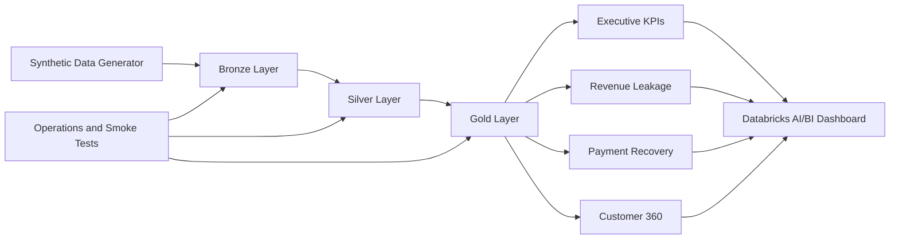
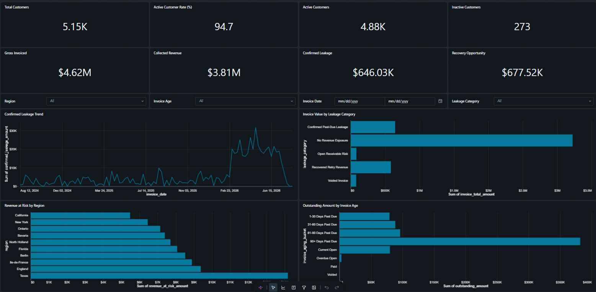
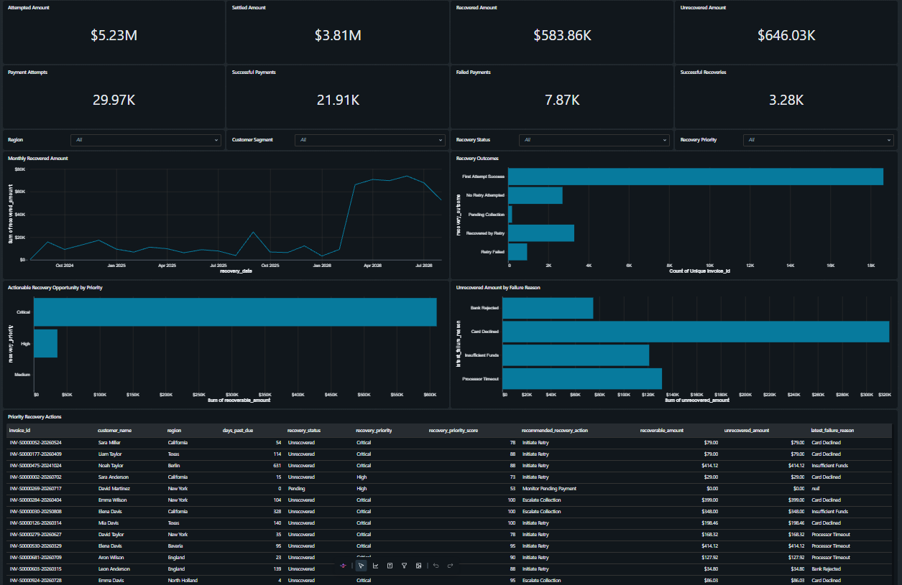
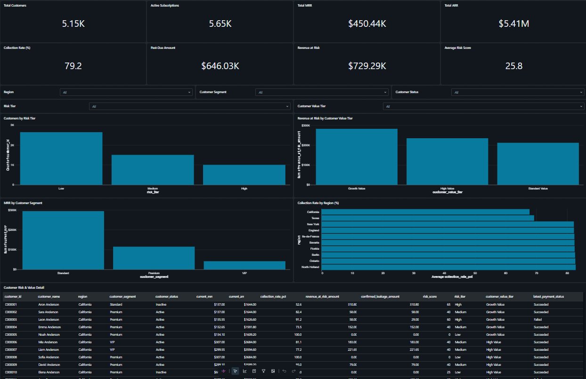

# Revenue Leakage & Customer 360 Lakehouse


An end-to-end Databricks Lakehouse project that generates realistic synthetic SaaS billing data, processes it through a Bronze–Silver–Gold architecture, identifies revenue leakage and payment recovery opportunities, and provides a unified Customer 360 view through an executive AI/BI dashboard.

## Business Objectives

The platform is designed to answer key business questions:

* How much invoiced revenue has been collected, lost, or remains outstanding?
* Which invoices and customers require immediate collection action?
* Where are payment failures and recovery opportunities concentrated?
* Which customers have the highest revenue and churn risk?
* How do revenue leakage and collection performance vary by region, segment, and invoice age?

## Architecture



## Medallion Architecture

| Layer          | Purpose                                                                            |
| -------------- | ---------------------------------------------------------------------------------- |
| Setup          | Creates the required catalog, schemas, and project configuration                   |
| Data Generator | Produces deterministic synthetic customer, subscription, invoice, and payment data |
| Bronze         | Incrementally ingests raw source data into Delta tables                            |
| Silver         | Applies validation, deduplication, standardization, and quarantine handling        |
| Gold           | Builds Customer 360, revenue leakage, payment recovery, and executive KPI tables   |
| Operations     | Runs workflow validation, data-quality checks, and smoke tests                     |
| Dashboard      | Provides executive, payment recovery, and Customer 360 analytics                   |

## Gold Data Products

The Executive Dashboard uses four curated Unity Catalog tables:

* `workspace.revenue_leakage_gold.executive_kpis`
* `workspace.revenue_leakage_gold.revenue_leakage`
* `workspace.revenue_leakage_gold.payment_recovery`
* `workspace.revenue_leakage_gold.customer_360`

## Executive AI/BI Dashboard

The published Databricks AI/BI Dashboard contains three business-facing pages with interactive filters, KPI cards, analytical charts, and operational detail tables.

### Executive Overview

Provides a consolidated view of customers, invoiced revenue, collections, confirmed leakage, and recovery opportunities.



Main components:

* Total Customers
* Active Customer Rate
* Active and Inactive Customers
* Gross Invoiced Amount
* Collected Revenue
* Confirmed Revenue Leakage
* Recovery Opportunity
* Confirmed Leakage Trend
* Invoice Value by Leakage Category
* Revenue at Risk by Region
* Outstanding Amount by Invoice Age
* Region, invoice age, invoice date, and leakage category filters

### Payment Recovery

Tracks payment activity and identifies the highest-priority recovery opportunities.



Main components:

* Attempted Amount
* Settled Amount
* Recovered Amount
* Unrecovered Amount
* Payment Attempts
* Successful and Failed Payments
* Successful Recoveries
* Monthly Recovered Amount
* Recovery Outcomes
* Actionable Recovery Opportunity by Priority
* Unrecovered Amount by Failure Reason
* Priority Recovery Actions table
* Region, customer segment, recovery status, and recovery priority filters

### Customer 360

Combines customer, subscription, invoice, payment, collection, customer value, and risk information into a unified customer-level view.



Main components:

* Total Customers
* Active Subscriptions
* Total MRR and ARR
* Collection Rate
* Past-Due Amount
* Revenue at Risk
* Average Risk Score
* Customers by Risk Tier
* Revenue at Risk by Customer Value Tier
* MRR by Customer Segment
* Collection Rate by Region
* Customer Risk & Value Detail table
* Region, segment, status, risk tier, and customer value tier filters

## Current Synthetic Snapshot

| KPI                       |   Result |
| ------------------------- | -------: |
| Total Customers           |    5.15K |
| Active Customer Rate      |    94.7% |
| Gross Invoiced Amount     |   $4.62M |
| Collected Revenue         |   $3.81M |
| Confirmed Revenue Leakage | $646.03K |
| Recovery Opportunity      | $677.52K |
| Recovered Amount          | $583.86K |
| Revenue at Risk           | $729.29K |
| Total MRR                 | $450.44K |
| Total ARR                 |   $5.41M |

## Workflow and Validation

The complete Databricks workflow contains 13 tasks covering setup, synthetic data generation, Bronze ingestion, Silver transformations, Gold analytics, and operational validation.

Final execution results:

* 13/13 workflow tasks passed
* 56/56 smoke tests passed
* All Gold datasets successfully loaded
* Dashboard datasets successfully validated
* Executive Dashboard successfully published
* Dashboard source committed to Git

## Technology Stack

* Databricks
* Apache Spark
* PySpark
* Spark SQL
* Delta Lake
* Unity Catalog
* Databricks Workflows
* Databricks AI/BI Dashboards
* Git
* GitHub

## Repository Structure

```text
.
├── Src
│   ├── 00_setup
│   ├── 01_data_generator
│   ├── 02_bronze
│   ├── 03_silver
│   ├── 04_gold
│   ├── 05_operations
│   └── 06_dashboard
│       └── Revenue Leakage & Customer 360 Executive Dashboard.lvdash.json
├── docs
│   └── images
│       ├── executive-overview.png
│       ├── payment-recovery.png
│       └── customer-360.png
└── README.md
```

## Running the Project

1. Add the repository as a Databricks Git folder.
2. Run the configured 13-task Databricks workflow.
3. Confirm that all workflow tasks and smoke tests pass.
4. Open the dashboard source from `Src/06_dashboard`.
5. Connect the dashboard to an available SQL warehouse.
6. Publish the dashboard using the appropriate workspace permissions.

## Dashboard Access

The dashboard is published using controlled Databricks workspace access.

Dashboard viewers must be granted the appropriate permissions. The repository does not expose a public dashboard link or confidential workspace credentials.

## Data Notice

All customer, subscription, invoice, payment, and recovery data used in this project is synthetically generated.

No real customer information or confidential business data is included.
